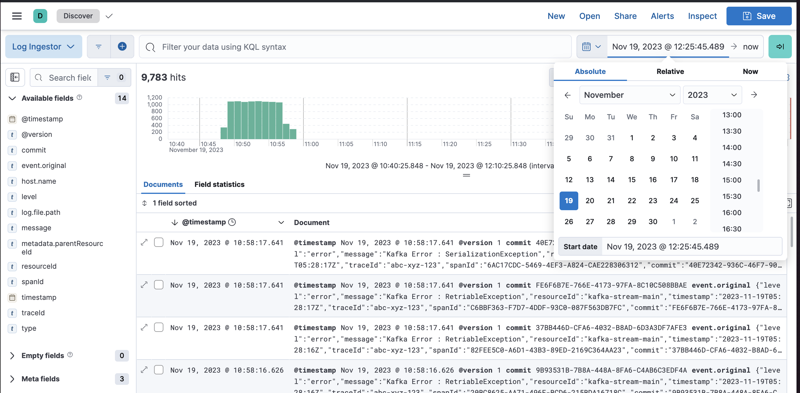
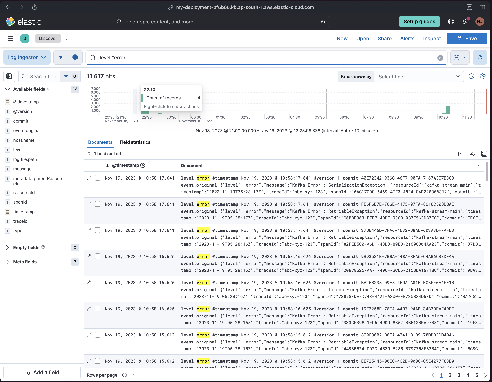
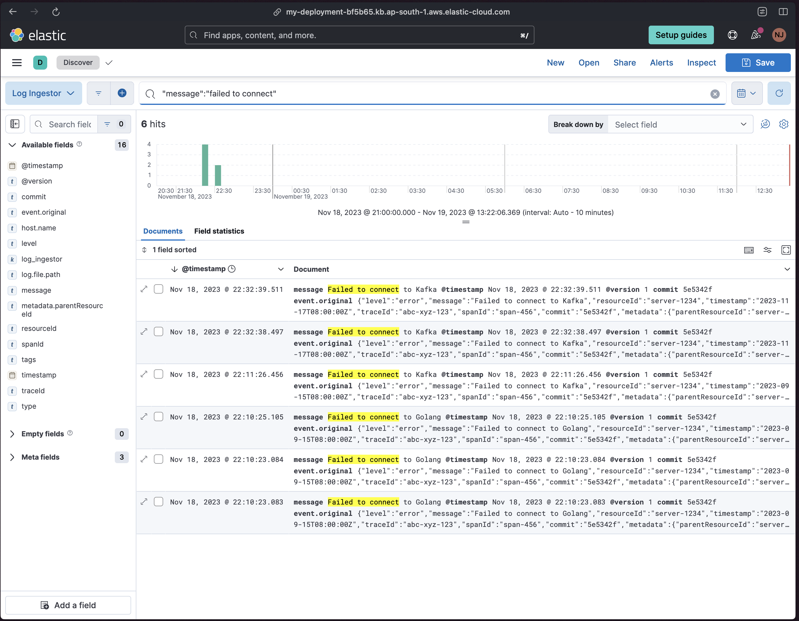
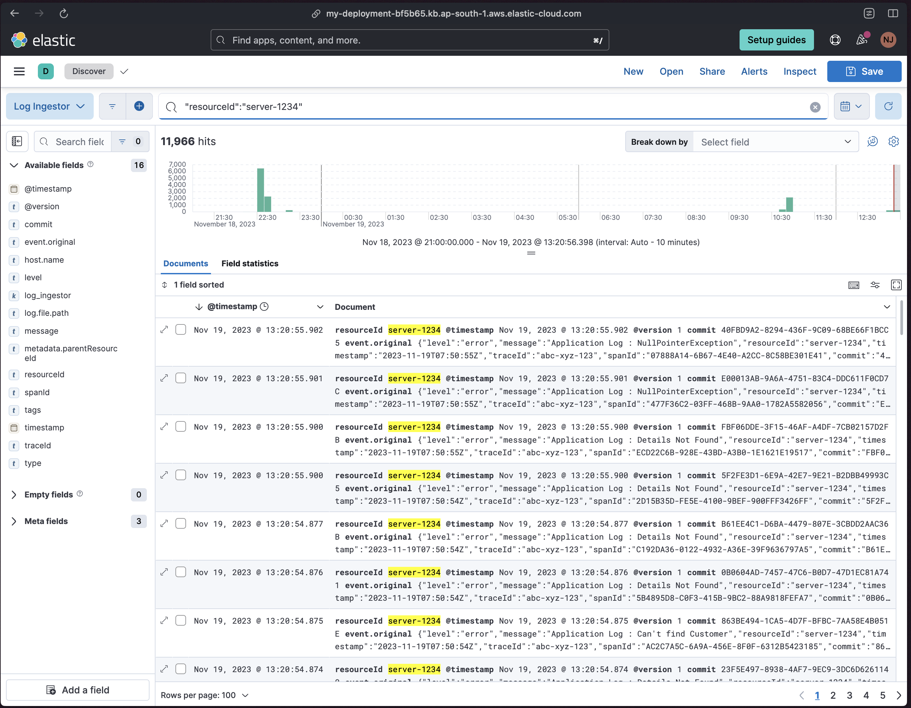
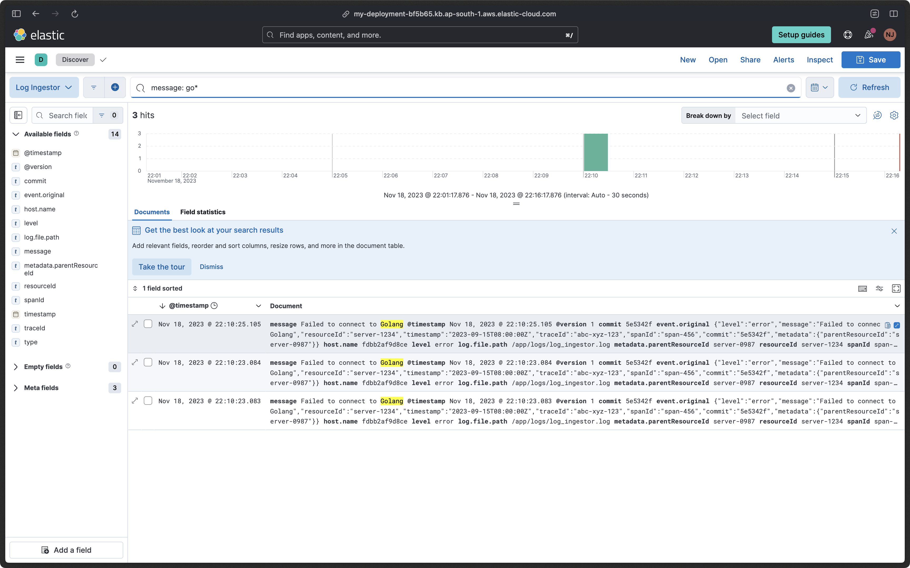
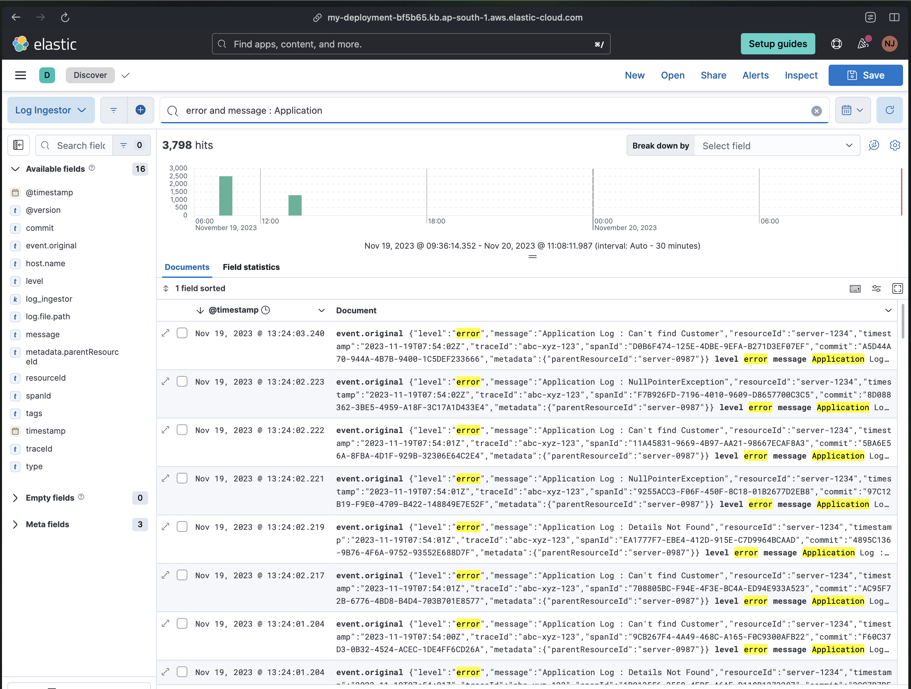
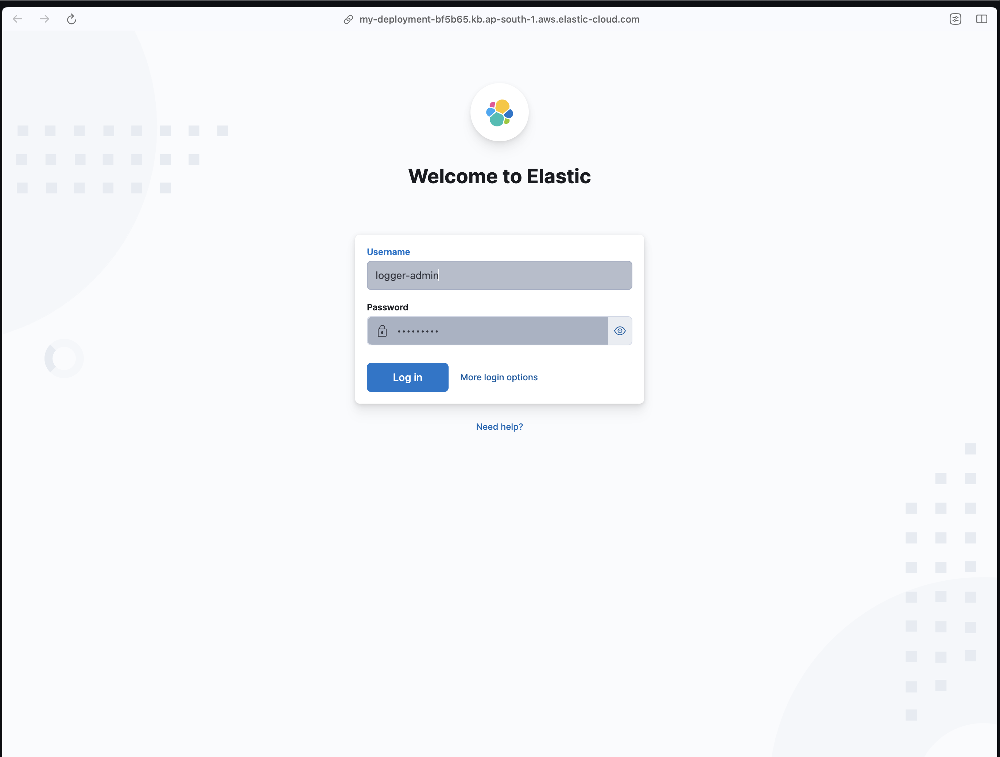

# Log Ingesting Service

## Objective

Develop a log ingestor system

## Requirements

The requirements for the log ingestor and the query interface are specified below.

### Log Ingestor:

-   Develop a mechanism to ingest logs in the provided format.
-   Ensure scalability to handle high volumes of logs efficiently.
-   Mitigate potential bottlenecks such as I/O operations, database write speeds, etc.
-   Make sure that the logs are ingested via an HTTP server, which runs on port `3000` by default.

### Query Interface:

-   Offer a user interface (Web UI or CLI) for full-text search across logs.
-   Include filters based on:
    -   level
    -   message
    -   resourceId
    -   timestamp
    -   traceId
    -   spanId
    -   commit
    -   metadata.parentResourceId
-   Aim for efficient and quick search results.

## Evaluation Criteria:

Your submission will be evaluated based on the following criteria.

-   Volume: The ability of your system to ingest massive volumes.
-   Speed: Efficiency in returning search results.
-   Scalability: Adaptability to increasing volumes of logs/queries.
-   Usability: Intuitive, user-friendly interface.
-   Advanced Features: Implementation of bonus functionalities.
-   Readability: The cleanliness and structure of the codebase.

# Logging Ingesting System Implementation

## Golang Server Implementation

-   The Golang server is set up to ingest logs on port 3000.
-   The logs are written to a file as part of the logging process.

## Log Processing with Logstash

-   Logstash is utilized to send logs from the file to Elastic Cloud.
-   The log processing includes the creation of indices to organize the logs effectively.

## Visualization in Kibana

-   The processed logs are made visible in Kibana, providing a centralized platform for log analysis and visualization.

## Optional: Kibana Dashboard

-   An optional Kibana dashboard has been considered and may be implemented for monitoring purposes.

## Role-Based Access Control

-   Role-based access control is implemented for Kibana.
-   A custom role is created, allowing access to both Kibana and Logstash for specific user roles.

## Log Bombing Scripts

-   Scripts are created to simulate log ingestion by bombarding port 3000 with four types of logs:
    1. Application Logs: 100 requests per second (RPS)
    2. Application Error Logs: 5 RPS
    3. Kafka Error Logs: 3 RPS
    4. DB Error Logs: 2 RPS

## Security Measures

-   Security measures, including access control and role-based permissions, are implemented to ensure the confidentiality and integrity of the logging system.

## Documentation

-   Comprehensive documentation is available, detailing the architecture, data flow, security measures, and the log bombing scripts.

## Scalability

-   The system is designed with scalability in mind to handle varying log volumes effectively.

This logging and monitoring system is configured to handle log ingestion, processing, and visualization, with optional monitoring features and robust security measures in place.

# Project Stack

-    Golang
-    Elasticsearch
-    Logstash
-    Kibana

# Project Installation and Setup Guide

To install and run the project, please follow the steps below. Ensure that you have Docker, Docker Compose, and Homebrew installed on your system.

## Prerequisites

### Install Docker, Docker Compose, and Homebrew

Follow the links to install the required tools:

-   [Docker](https://www.docker.com/get-started)
-   [Docker Compose](https://docs.docker.com/compose/install/)
-   [Homebrew](https://brew.sh/)

## Project Setup

1. Clone the repository:

    ```bash
    gh repo clone repo-link
    cd log-service-golang
    ```

2. Paste the following environment variables into the code. Update the values according to your configuration:

```sh
ELASTIC_SEARCH_HOSTS
ELASTIC_SEARCH_USER_NAME
ELASTIC_SEARCH_PASSWORD
```

3.Run Docker Compose to start the project:

```sh
docker-compose up
```

You will have the server ready to ingest logs at PORT 3000 .

## Deployement

Once the current server is up and running at PORT 3000 and the logs are being ingested the Dashboard can be seen on this url

# Kibana Dashboard

## [Kibana](https://bit.ly/3QOBv8m)

Since role-based authentication is implemented, please reach out to `nimeshjohari95@gmail.com` for the credentials.

To view logs in Kibana, ensure that the correct index, "Log-ingestor," is selected. You can use the following URL to access the logs:

After accessing the logs using this URL, adjust the time filter from the top-right corner to see the latest logs. The image below illustrates this process:




## Sample Queries

The following are some sample queries that will be executed for validation.

-   Find all logs with the level set to "error".
    
-   Search for logs with the message containing the term "Failed to connect".
-   
-   Retrieve all logs related to resourceId "server-1234".
-   
-   Filter logs between the timestamp "2023-09-10T00:00:00Z" and "2023-09-15T23:59:59Z". (Bonus)
-   

## Advanced Features (Bonus):

These features aren’t compulsory to implement, however, adding them might increase the chances of your submission being accepted.

-   Implement search within specific date ranges.
    
-   Utilize regular expressions for search.
    
-   Allow combining multiple filters.
    
-   Provide real-time log ingestion and searching capabilities - Logstash supports realtime log ingestion and searching thus this is implemented.

-   Implement role-based access to the query interface . I have created a user with roles and only with those roles the user can access the Kibana Dashboard.
    
